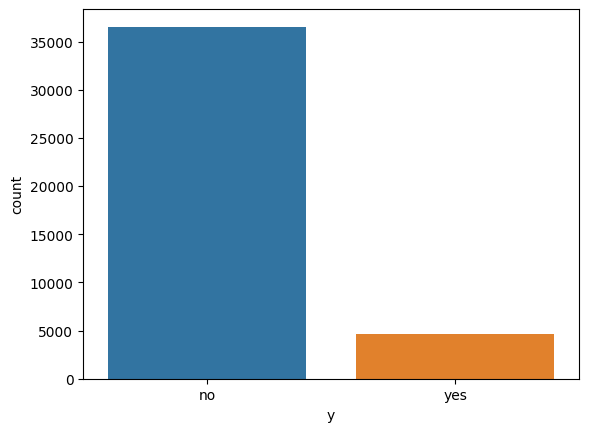
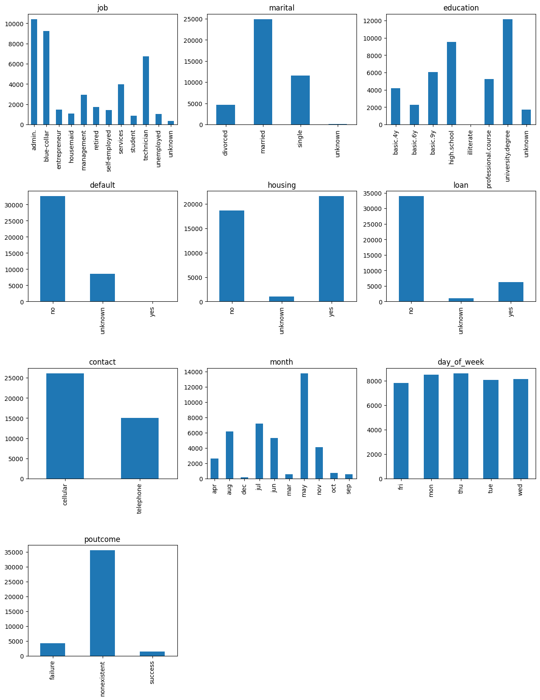
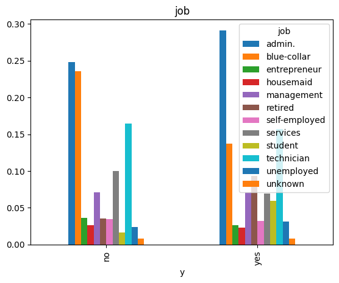
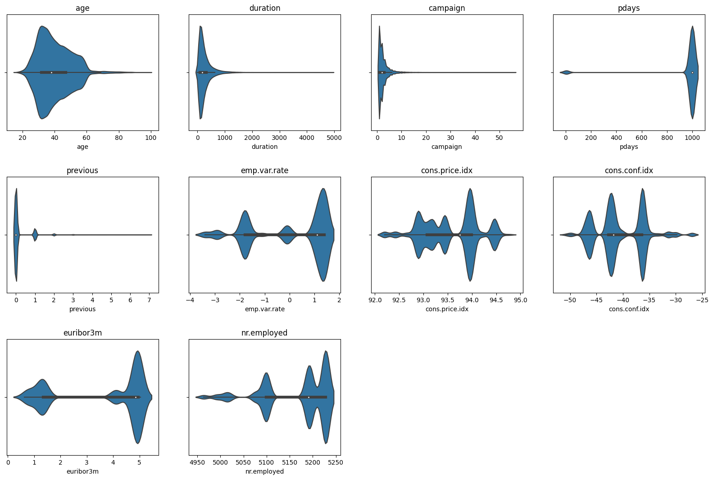
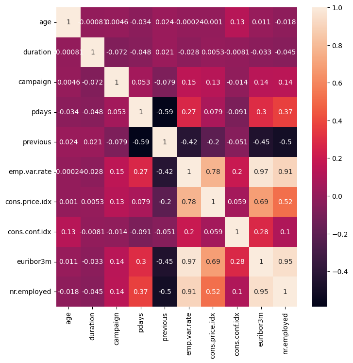
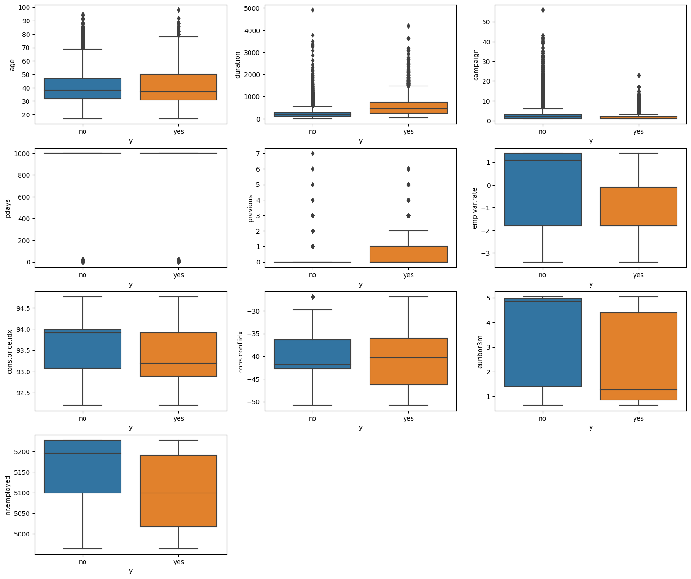
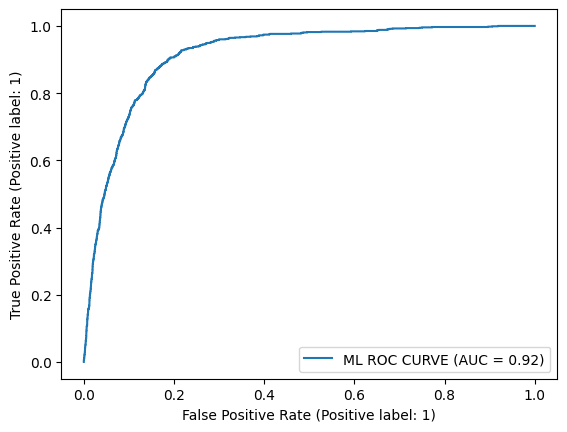
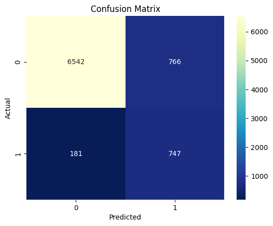
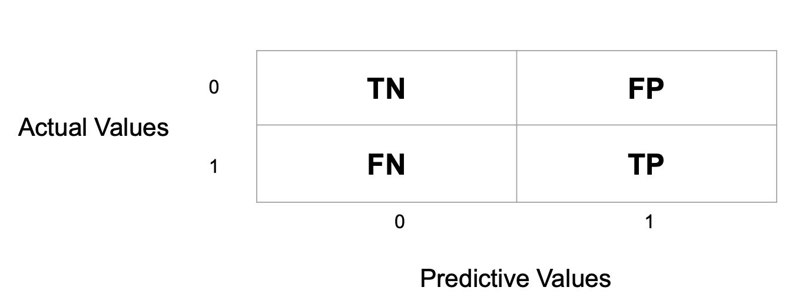

# MLOps

패스트캠퍼스 강의 ([10개 프로젝트로 한 번에 끝내는 MLOps 파이프라인 구현](https://fastcampus.co.kr/data_online_mlopspj))


## 목차

머신러닝 모델 상품화 과정

- [1 모델 학습](#1-모델-학습)
- [2 인프라](#2-인프라)
- [3 플랫폼](#3-플랫폼)
- [4 상용화](#4-상용화)

## 1 모델 학습

### 1 문제정의

데이터를 활용해 어떠한 문제를 해결할지 정의한다.

- ex) 직원 Profile 데이터를 활용해 이 직원이 추후 퇴사할 지 여부를 판단한다.
- ex) 항공기가 얼마나 지연되어 도착할 지를 예측한다.
- ex) 은행 고객 데이터를 분석하여 마케팅을 진행할 지 여부를 분석한다.

### 2 EDA (Explore Data Analysis)

#### 데이터 요악 정보 확인

- Categorical or Numerical
- Dependent or Independent

#### 불필요 데이터 제거

- 중복된 data 제거
- N/A Data 처리

#### Dependent(종속) Data Explore

Imbalance data set 확인 및 해결 필요



- 데이터 기반 접근 방법: sampling
- ML 알고리즘 기반 접근방법: cost-sensitive learning

#### Independent(독립) Categorical Data Explore

column별 분포 확인



target column과의 분포 확인



target column과의 상관관계 확인 (카이제곱 검정)

```python
# 카이제곱 검정 코드
list_meaningful_column_by_chi = []

for column_name in list_categorical_columns:
  statistic, pvalue, _, _ = chi2_contingency(pd.crosstab(df[target_column], df[column_name]))
  if pvalue <= 0.05:
    list_meaningful_column_by_chi.append(column_name)
  print(column_name, statistic, pvalue)

print("all categorical columns : ", len(list_categorical_columns))
print("selected columns by chi : ", len(list_meaningful_column_by_chi), list_meaningful_column_by_chi)

# selected columns by chi :  8 ['job', 'marital', 'education', 'default', 'contact', 'month', 'day_of_week', 'poutcome']
```

##### Independent(독립) Numerical Data Explore

column별 분포 확인



column간의 상관관계 확인 (Correlation Analysis, VIF Analysis)



target column과의 분포 확인



target column과의 유의미 관계 확인 (크루스칼 왈리스 검정)

```python
list_column_normality = []
for column_name in list_numeric_columns:
  statistic, pvalue = stats.shapiro(df[column_name])
  if pvalue > 0.05:
    list_column_normality.append(column_name)
  print(column_name, ", statistic : ",statistic,", pvalue : ", pvalue)
print("정규성 만족하는 column 수 : ", len(list_column_normality))
```

### 3 Feature Engineering

#### Feature Selection

- 카이제곱 검정을 통과한 categorical 선택
- kruskall 검정 통과한 numerical 선택
- correlation에서 상관관계가 높다고 판단한 numericla data 제거

#### Feature Transformation

- Label Encoding
- feature scaling for numerical data
- One-hot Encoding for categorical column dat
- Sampling for imbalanced data (by SMOTEENN, ..)

### 4 Model Training & Analysis

#### Model Optimization

- Base Model Learning
- Optimization 1 : ML with Feature Selection (No samping)
- Optimization 2 : ML with Feature selection and Combined Sampling
- Optimization 3 : ML with Feature Selection and No Combined Sampilng + Cost Sensitive Learning

#### Model Matrix





- Accuracy(정확도) = (TP+TN)/(TP+FN+FP+TN))
- Precision(정밀도) = (TP)/(TP+FP)
- Recall(재현도) = (TP)/(TP+FN)
- F1 Score = Precision과 Recall의 조화평균 = (2 _ Precision _ Recall)/(Precision+Recall)

## 2 인프라

https://github.com/choikwangil95/MLOps/blob/main/lecture/2_ML_MLOps/3_ML_Infra.md

- Storage
- Computing Resource
- Container ex) Docker
- Orchestrator ex) k8s
- Workflow Management ex) MLFlow
- CI/CD

## 3 플랫폼

### 1 MLFlow

머신러닝 프로젝트를 관리하기 위한 오픈소스 플랫폼


구성요소

- MLFlow Tracking : 머신러닝 모델 학습 결과를 추적하고, 다양한 프레임워크에서 동작할 수 있는 학습 코드의 재현성을 보장하는 기능
- MLFlow Projects : 머신러닝 프로젝트의 코드, 환경 설정, 종속성 등을 관리
- MLFlow Models : 학습된 머신러닝 모델을 관리하고, 다양한 환경에서 모델을 배포할 수 있는 기능 제공
- MLFlow Registry : 모델 버전을 관리하고, 공동 작업을 위한 모델 저장소를 제공

## 4 상용화

### 1 NLP 모델의 실시간 API 서빙 및 인증 기반 사용량 모니터링 파이프라인 구축


- 1 NLP 모델 GCS 업로드 라이브러리
- 2 NLP 모델 GKE Helm 기반 배포
- 3 NLP 모델 실시간 API Serving
